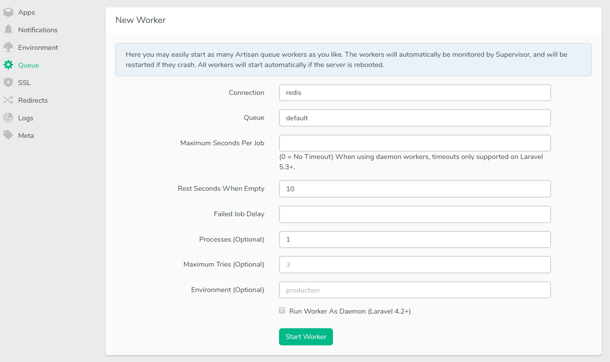

Today I was facing another mysql issue when working on my new side project. The issue was that I was writing more jobs into the `jobs` table than the database queue driver could work off. Here is how I solved this issue and how I would recommend everyone to setup their queue on small servers.

<!-- more -->

After playing around with the mysql configuration in an attempt to get better performance out of it, I had to accept the fact, that mysql was just not suite able for this amount of jobs - at least not with my small digital ocean droplet 😉

So the best way for me to get a better performance out of my queue was simple and effective: Use [Redis](https://redis.io/) as queue driver! 🔥

Since redis lives in the memory of the server, the execution time for each job drops to a minimum. I don't have time comparisons ready but I can feel the difference on the server: The queue is working off jobs almost as fast as they come in and the server now runs stable.

To get redis running as queue driver in your Laravel project, you need to fulfill the prerequisites. This is quite simple, so don't worry. All you have to pull in the [predis/predis](https://packagist.org/packages/predis/predis) package through composer 😉

```bash
composer require predis/predis
```

Next you need to set the queue connection in your `.env` file.

```
QUEUE_CONNECTION=redis
```

The last thing you need to setup, is a queue worker process on your server. On forge this is super easy. Just navigate to the configuration of your site, and add a new queue driver through the form.



And that's it! You should have a very quick queue set up 😁

