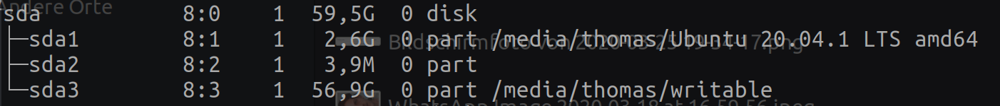

In this small article we are going to take a look on how you can create a bootable usb stick ready for your UEFI bios.

<!-- more -->

Ok ok, this is an old one but I still find my self googling it, so I will just write it down so I never have to do so again 😉

Ok, so we start by finding out the device path to our USB stick. To do so, go ahead and attach it to your computer.

Next we will list all mounted _block devices_ using `lsblk`. The output of this command will look similar to the following.

As you can see, the device is mounted as `sda`, so the device path is `/dev/sda`. That's our takeaway of this step.

Now here is the catch: If you want to use your USB stick to create a UEFI bootable system - the one that's booting faster 😉 - then you don't have to use the `/dev/sda1` as you'll see all around the internet but the `/dev/sda` device path. 
I had to learn that the hard way because one of my systems succeeded booting using the old approach but the others didn't and I was really suffering because I could not figure it out 🤯 But now that I know it I can share it with you 😁

Ok, so now that we got that out of the way, we can run `dd`.

