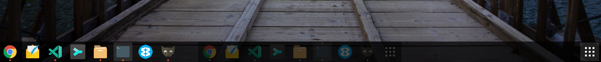

I really love ubuntu but there are some things that I don't like about it. One of it is that you can't disable the ubuntu dock using the default way. But don't worry, I got you covered 😉

<!-- more -->

If you have found your self using an extension like [dash-to-dock](https://extensions.gnome.org/extension/307/dash-to-dock/) on ubuntu gnome, then you might have noticed, that when you log back in from a locked screed, then the ubuntu dock might overlap the dash-to-dock ... dock.



But there is an easy fix for this. Using the `gnome-shell-extensions-tool` you can disable the ubuntu-dock for real.

```bash
gnome-shell-extension-tool -d ubuntu-dock@ubuntu.com
```

The `-d` flag is used to disable the an extension. But you will be able to enable the extension again using the `-e` flag as shown in the following.

```bash
gnome-shell-extension-tool -e ubuntu-dock@ubuntu.com
```

And that's it, you should no longer face the issue again 😁