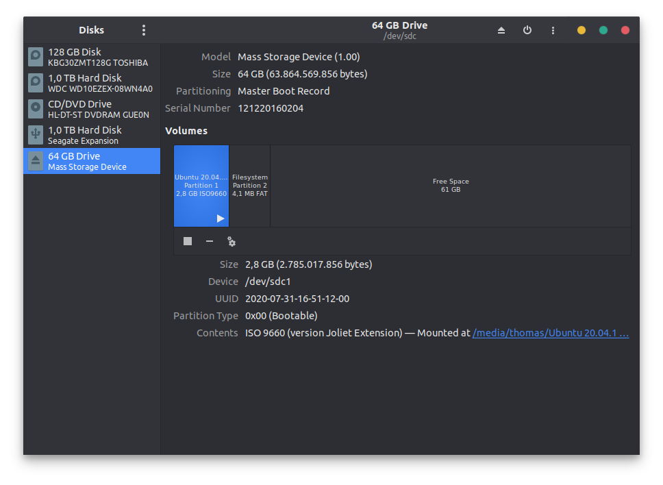
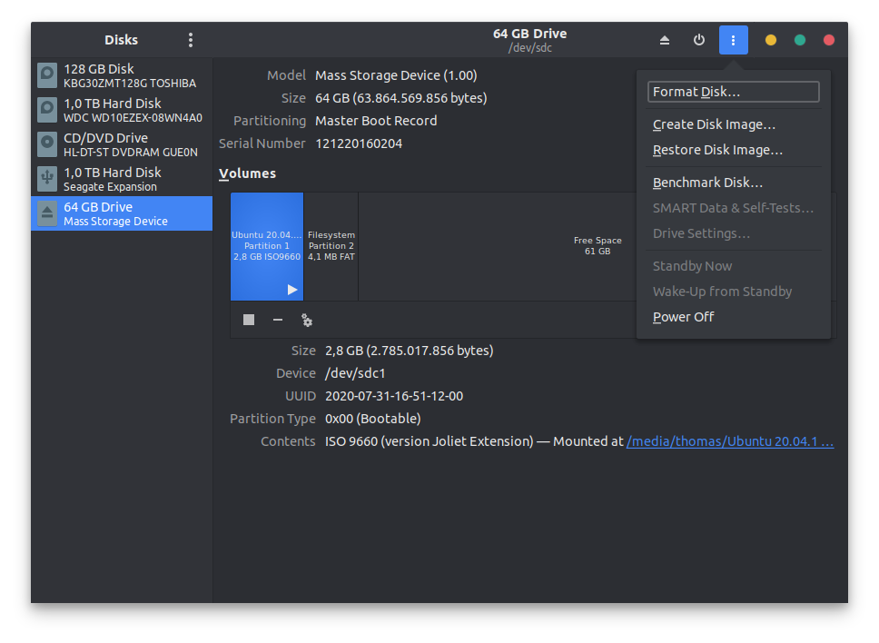

Last week we took a look on [how to create a bootable USB stick using the command line tool `dd`](/articles/create-uefi-bootable-usb-stick-using-dd). Today we are going to see how to do the same using the GUI.

<!-- more -->

> Note that if you are trying to install a *Windows ISO* image, you will find, that these are missing a partition table - good Job Microsoft 🤦‍♂️ - however instead of using the *Disk* utility as shown in this article, you might want to checkout [WoeUSB](https://github.com/WoeUSB/WoeUSB) 🧐

Ubuntu ships with the _Disks_ program we can use to format the and create a bootable USB stick.

Once we have started the program, we select our USB stick in the left column and open the device menu through the menu icon in the top right corner of the application.

Here you can select the action you want to perform. What we want to do is to _Restore Disk Image ..._. Optionally you can run _Format Disk..._ first.

In the dialogue that opens you just have to select the ISO file that you want to use and then you can click the _Start Restoring..._ button.

You will be prompted a warning - one that you should check 😉 - to make sure you have selected the correct target. Once you confirm, the process will start. This will take a couple of minutes so feel free to grab a cup of coffee ☕

Once the process is finished you are done 😁