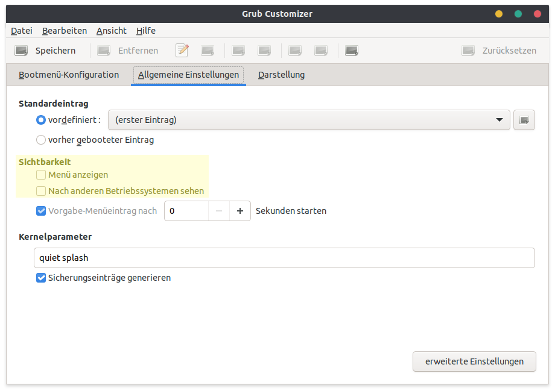

When you have a single boot system but GRUB still shows up, you probably want to hide it, since it adds to your boot time. Here is how 😃

<!-- more -->

First you will need to install the `grub-customizer`.

```bash
sudo apt install grub-customizer
```

Next you just have to start it and go to _General Settings_ to disable the options _Hide Menu_ and _Look for other Operating Systems_. See screenshot below.



Press _Save_ and you're done! 👌