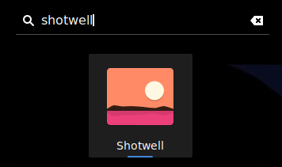
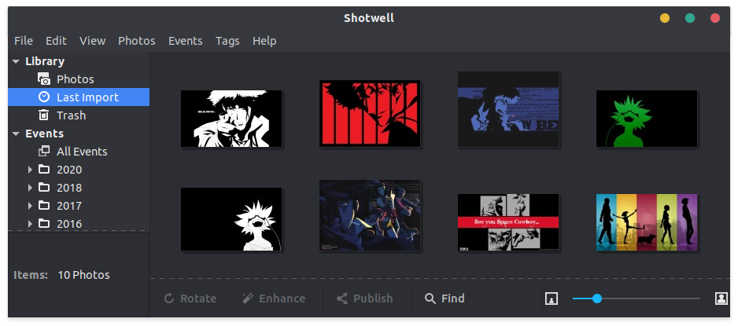
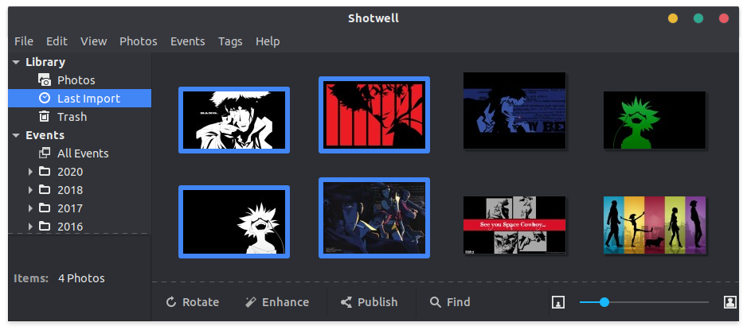
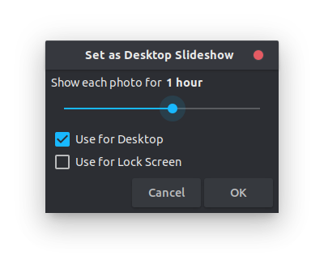

Do you need some change in your life? Then try out desktop wallpaper slideshows. It's just nice to see the desktop change once in a while 😊

<!-- more -->

So the easiest way I know to create a changing wallpaper is to use the _personal photo manager_ [Shotwell](https://wiki.gnome.org/Apps/Shotwell/).

So, assuming you already have the images that you want to setup as a wallpaper slideshow on your machine, you can just open shotwell through the launcher or by typing `shotwell` in the terminal.

Next you will need to import the images you downloaded. Go to _File -> Import From Folder_ or press `Ctrl+I` and select the folder you stored your wallpapers in.

Once the import is done, you should see them in the _Last Import_ section of the application.

Now you can select the images that you want to have in your wallpaper slideshow.

Then you can go to _File -> Set as Desktop Slideshow_ or press `Ctrl+B` to use your selection as desktop wallpaper slideshow.

In the prompted dialog you can choose how long each image should stay active as your desktop wallpaper. Additionally you can choose if your selection should be used for the desktop and/or the lock screen.

And that's it, enjoy! 😁