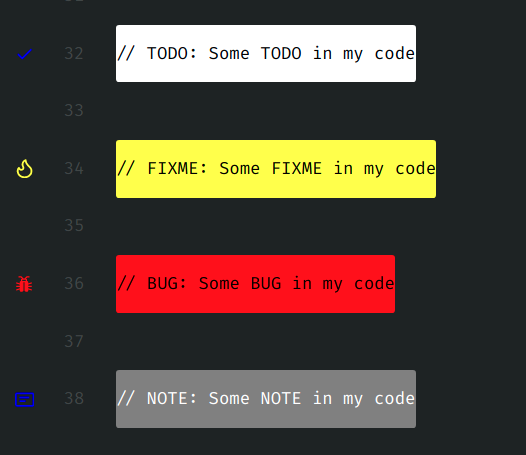
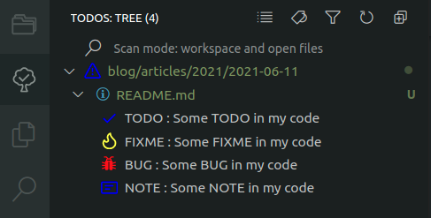
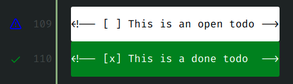
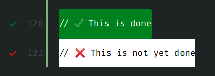
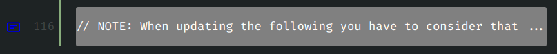
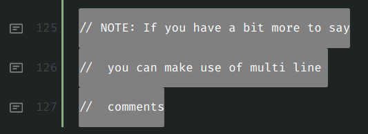

Today we are going to take a look at the best way to manage TODOs in vscode I found so far.

<!-- more -->

So recently I had to take over a project where the developer had left a lot of TODOs in his code - important ones that have not been represented in our task management tool. So for a short moment I was actually missing phpstorm since it has a nice way of handing TODOs out of the box. But then I found this awesome vscode extension [Todo Tree](https://marketplace.visualstudio.com/items?itemName=Gruntfuggly.todo-tree).

## What does it do?

Todo Tree does not only provide highlighting for TODOs and other tags such as `FIXME`, `BUG` or any other custom tag that you want to add, but also provides a _realy_ nice way to list them.



<br />



As you can see Todo Tree does a great job on highlighting TODOs but also provides a nice list to navigate through it.

## Configuration

Configuration is easy. Just add the following to your vscode json settings and you have a basic self explanatory example config to start with.

```json
"todo-tree.highlights.defaultHighlight": {
    "icon": "alert",
    "type": "text-and-comment",
    "foreground": "black",
    "background": "white",
    "opacity": 50,
    "iconColour": "blue",
    "gutterIcon": true,
},
"todo-tree.highlights.customHighlight": {
    "TODO": {
        "icon": "check",
        "foreground": "black",
        "background": "white",
        "iconColour": "white",
    },
    "NOTE": {
        "icon": "note",
        "foreground": "white",
        "background": "gray",
        "iconColour": "gray",
    },
    "COMMENT": {
        "icon": "note",
        "foreground": "white",
        "background": "gray",
        "iconColour": "gray",
    },
    "FIXME": {
        "foreground": "black",
        "background": "yellow",
        "iconColour": "yellow",
    },
    "BUG": {
        "foreground": "black",
        "background": "red",
        "iconColour": "red",
    },
    "[ ]": {
        "icon": "check",
        "foreground": "black",
        "background": "white",
        "iconColour": "yellow",
    },
    "[x]": {
        "icon": "check",
        "foreground": "white",
        "background": "green",
        "iconColour": "green",
    }
},
"todo-tree.general.tags": [
    "BUG",
    "HACK",
    "FIXME",
    "TODO",
    "NOTE",
    "COMMENT",
    "[ ]",
    "[x]"
],
"todo-tree.regex.regex": "(//|#|<!--|;|/\\*|^|^\\s*(-|\\d+.))\\s*($TAGS).*(\\n\\s*//\\s{2,}.*)*",
```

Ok, that's a bit too much to just throw it at you, so let's take a closer look.

The first section `todo-tree.highlights.defaultHighlight` defines the default highlighting styles for any tag.

The second section `todo-tree.highlights.customHighlight` overwrites it for a given tag.

The third section `todo-tree.general.tags` defines what tags to look for in your code.

## Icons

Yes icons deserve their own section 😉 Todo Tree uses the `codicon` iconfont. You can browse the list of available icons to set in your configuration [here](https://microsoft.github.io/vscode-codicons/dist/codicon.html).

## Usage Ideas

Before you go, here are some useful ideas on how you can make this extension really work for you 😁

### Checklists



<br />



For some reason the `close` icon that should represent the cross is not working 🤔

### Notes



### Multiline TODOs

It is possible to have multiline todos and comments by adjusting the regular expression that is used to search for the tags.

```json
"todo-tree.regex.regex": "(//|#|<!--|;|/\\*|^|^\\s*(-|\\d+.))\\s*($TAGS).*(\\n\\s*//\\s{2,}.*)*",
```

With the given regular expression, you can have multiline todos for comments that start with `//`. Also every following line needs to have _two slashes_ and _two spaces_.



## More!

For further insights and configuration options, I suggest you check out the [package documentation](https://github.com/Gruntfuggly/todo-tree).

<br>
<br>

And that's it! 😁