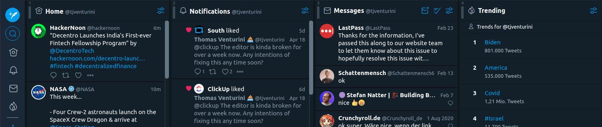
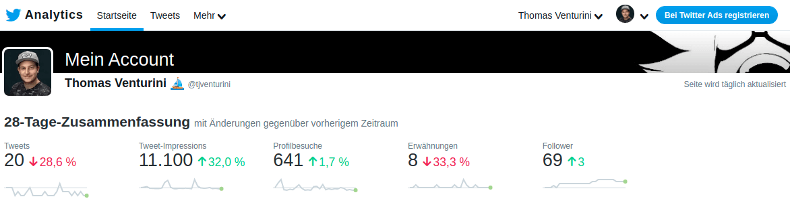
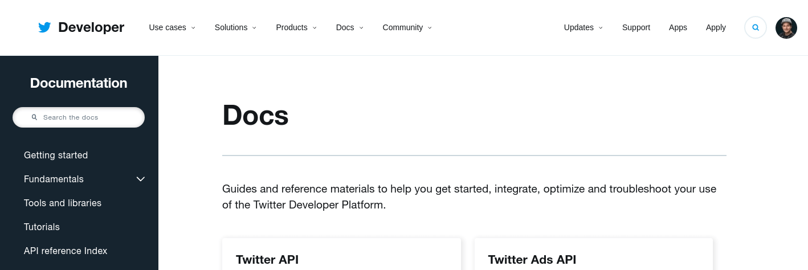
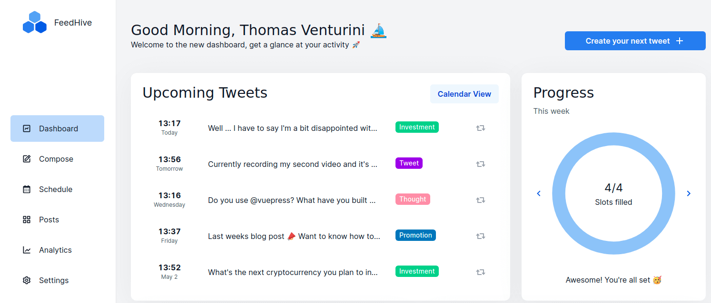

As I recently revived my twitter account, so I thought I share some handy tools for anyone who wants to start their journey on twitter 🤓

<!-- more -->

So first off, I want to say that at the time of writing this I have not yet been very successful on twitter. My follower count is 68 so I can't share much advice on how to grow your account there. All I can share with you are the tools that gave me my first insights on my twitter account.

## TweetDeck

[TweetDeck](https://tweetdeck.twitter.com/) is there to help you keep track of your engagement on twitter and helps you manage your communication.

It is very popular but I just don't like it because it feels way to crowded for me 😅 So if you have a nice alternative, let me know over twitter. For now I just use the twitter web client 😉 

## Twitter Analytics

If you need to get real insights about your twitter performance you should check out the [twitter analytics](https://analytics.twitter.com/) service.

## Developer Documentation

If you plan on developing an application using the twitter API would want to check out the [twitter developer documentation](https://developer.twitter.com/en/docs).

## Publish Tool

The [publish tool](https://publish.twitter.com/#) by twitter is a really handy tool if you want to quickly embed a tweet, profile, list or search. It provides a nice little form that let's you easily embed anything from twitter on your website.

## FeedHive.io

[FeedHive.io](https://feedhive.io/) is my favorite tool for twitter so far. This awesome tool let's you schedule your tweets and provides awesome analytics. If you plan on post on a regular basis, then you should definitely check it out! 🤩

 
 

And that's all I got for you on that topic so far. But I'll let you know once I figured out how to grow my audience on twitter 😉