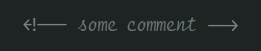
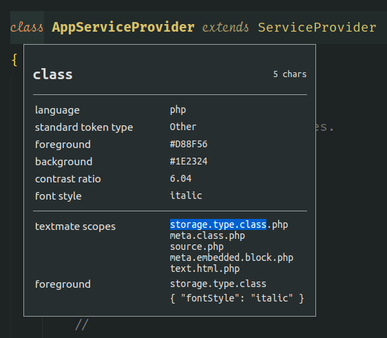

Recently I found out that my FiraCode article is one of my most popular articles. But the truth is, that I don't use FiraCode anymore because I exchanged it against FiraCodeiScript and did some tweaks on the highlighting. So I thought I should share my current setup with you!

<!-- more -->

[FiraCode](https://github.com/tonsky/FiraCode) is awesome. But as I saw a lot of the coding gurus online having these cool italic font-styles in their editors I wanted to find out how to have that too. So I started searching and quickly found [FiraCodeiScript](https://github.com/kencrocken/FiraCodeiScript).

## What is FiraCodeiScript?

FiraCodeiScript is _a font mashup to be used in code editors, displaying a script typeface for the italic font style_. This means that on top of FiraCode it provides you some italic font styles that will bring some extra sugar to your editor ❤

## How to install it?

To install the font you just [download](https://github.com/kencrocken/FiraCodeiScript/archive/refs/heads/master.zip) the repository as zip archive, open it and install the font's through double-click.

## Setup VSCode

Once the font is installed, you can make use of it in your vscode configuration.

### Change Font-Family

Open the vscode settings as json and search for `editor.fontFamily` and set it to `Fira Code iScript`. You most likely will need to restart vscode after that change.

```json
"editor.fontFamily": "Fira Code iScript",
```

> If the font is not available after you restarted vscode you might need to restart your system so the font is reloaded 🤷‍♂️

Also you might want to increase your editors font-size. I had to change it from 14 to 16 so it looks good again.

```json
"editor.fontSize": 16,
```

As soon as the font is active you will note that everything that was set to be italic in your code, will be displayed in the new italic style the FiraCodeiScript font provides. For me that was only the comments though 😅



But what about keywords like _class_, _return_, _new_ and all? Don't worry, that's what we're going to cover next 😉

## The Sugar! 😍

Once we have a cool italic font ready, we should specify the elements that should be italic - in addition to the vscode defaults. To do so we are going to use the [TextMate tokens and scopes](https://code.visualstudio.com/api/language-extensions/syntax-highlight-guide#textmate-tokens-and-scopes) that vscode can handle.

By adding the following to your vscode configuration you will add three _color customization scopes_ - yes they also handle the font-styles 😉 The scopes can be used to define elements that should be displayed in _bold_, _italic_ or _normal_. That way you can define your _bold_ and _italic_ elements but also set some exceptions if needed.

```json
"editor.tokenColorCustomizations": {
    "textMateRules": [
        {
            "scope": [
                // the following elements will be displayed in bold
            ],
            "settings": {
                "fontStyle": "bold"
            }
        },
        {
            "scope": [
                // the following elements will be in italic
                //   (=Fira Code iScript)
            ],
            "settings": {
                "fontStyle": "italic"
            }
        },
        {
            "scope": [
                // the following elements will be excluded from italics 
                //   (VSCode has some defaults for italics)
            ],
            "settings": {
                "fontStyle": ""
            }
        }
    ]
}
```

### Identifying the Tokens

To identify the TextMate token scope for a given element open up the command palette (`ctrl + shift + p`) and search for `Developer: Inspect Editor Tokens and Scopes`. This will bring up the [Scope Inspector](https://code.visualstudio.com/api/language-extensions/syntax-highlight-guide#scope-inspector) where you can get the identifier of the element you want to configure. Now you just have to click on the element you want to inspect and vscode will show you a list of matching scopes.



> The `.php` extension that refers to the language in use is optional. In this case I just used `storage.type.class`, so this will apply to all `class` keywords in all programming languages.

### Filling the Gaps

Now that you have the scopes and know how to identify the elements you want to change the font-style for, all you need to do is to fill in the gaps in the scopes you added to the configuration.

Here is the configuration that I came up with.

```json
"editor.tokenColorCustomizations": {
    "textMateRules": [
        {
            "scope": [
                // the following elements will be displayed in bold
                "entity.name.type.class", // class names
            ],
            "settings": {
                "fontStyle": "bold"
            }
        },
        {
            "scope": [
                // the following elements will be in italic
                //   (=Fira Code iScript)
                "comment",
                "keyword.control.import.js", // import
                "keyword.control.export.js", // export
                "keyword.control.from.js", // from
                // "constant", // String, Number, Boolean…, this, super
                "storage.modifier", // static keyword
                "storage.type.class", // class keyword
                "storage.type.php", // typehints in methods keyword
                "keyword.other.new.php", // new
                "entity.other.attribute-name", // html attributes
                "fenced_code.block.language.markdown" // markdown language modifier
            ],
            "settings": {
                "fontStyle": "italic"
            }
        },
        {
            "scope": [
                // the following elements will be excluded from italics 
                //   (VSCode has some defaults for italics)
                "invalid",
                "keyword.operator",
                "constant.numeric.css",
                "keyword.other.unit.px.css",
                "constant.numeric.decimal.js",
                "constant.numeric.json",
                "comment.block",
                "entity.other.attribute-name.class.css",
            ],
            "settings": {
                "fontStyle": ""
            }
        }
    ]
}
```

And that's basically it! 😁

## Other Fonts

Here is a list of other fonts that might your taste even better.

* [FiraFlott](https://github.com/kosimst/FiraFlott)
* [Firicico](https://github.com/kosimst/Firicico)