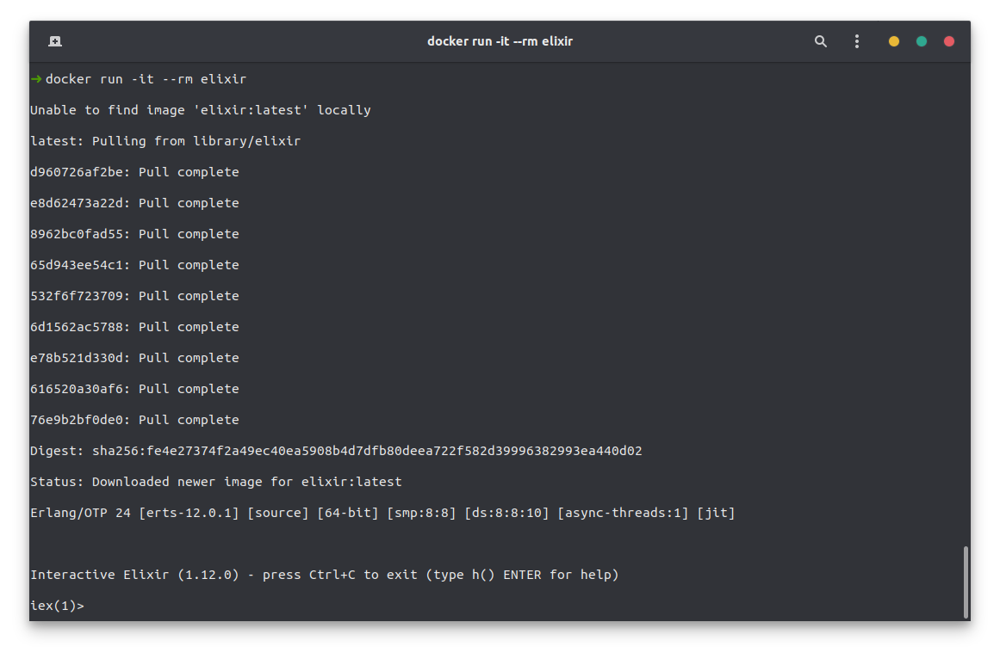
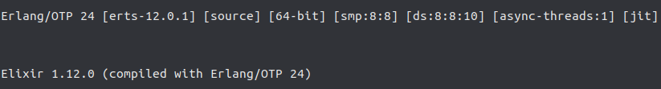

Recently we did a hacking week in our office. In the backend we decided to explore the [Elixir](https://elixir-lang.org/) programming language and the [Phoenix Framework](https://www.phoenixframework.org/). In this post I want to install Elixir and setup Phoenix in order to explore them in the next couple of articles. Let's go! 🚀

<!-- more -->

## What is Elixir?

Quote from the website:

> **Elixir is a dynamic, functional language for building scalable and maintainable applications.** 
> Elixir leverages the Erlang VM, known for running low-latency, distributed, and fault-tolerant systems. Elixir is successfully used in web development, embedded software, data ingestion, and multimedia processing, across a wide range of industries.

I don't have any experience at this point with the language and I think I should not try to explain the concepts of it until I have a better understanding of Elixir and Erlang - that's just how it is 🤷‍♂️

My starting point however in order to learn elixir will probably be the [getting started guide](https://elixir-lang.org/getting-started/introduction.html) in their documentation.

## What is the Phoenix Framework?

Phoenix is a Framework for the Elixir language - much like [Laravel](https://larave.com) for [Php](https://php.net) - and provides you a basic application structure and lot's of tools and helper. That's why it is a nice starting point to start my journey.

## Installing Elixir

You can install the elixir language directly on your system, or you can use the official docker containers. We will take a short look at both of it.

### Directly

The [installation](https://elixir-lang.org/install.html#gnulinux) is rather simple and strait forward, so you should not have problems with it 😉

```bash
# install the apt repository (ppa)
wget https://packages.erlang-solutions.com/erlang-solutions_2.0_all.deb && sudo dpkg -i erlang-solutions_2.0_all.deb
# update your package lists
sudo apt update
# install elixir and the esl-erlang 
sudo apt install esl-erlang elixir
```

### Docker

In order to use the docker setup you need to have docker installed. If you haven't done so yet, you can checkout [this article](/articles/install-docker-and-compose-in-ubuntu/) in order to do so.

Once you have docker installed, you can run the following to execute pull and execute the [elixir docker](https://elixir-lang.org/install.html#docker) container.

```bash
docker run -it --rm elixir
```

This might take some time but once it is done you should find your self in an active Elixir shell session ([iex](https://hexdocs.pm/iex/IEx.html)) session.



If you need to access the docker container itself, you can use the following to access it through a bash terminal.

```bash
docker run -it --rm elixir bash
```

## Different Versions

If you need to manage multiple Elixir versions, then you might want to check out the available [elixir version managers](https://elixir-lang.org/install.html#compiling-with-version-managers).

## Check Installation of Erlang and Elixir

Whatever installation method you choose, once done you should check if Elixir is available to you now. To do yo you can check the elixir version.

```bash
elixir --version
```

This will show some information about elixir and the environment it was build for.



## Setup Phoenix Framework

Once we have installed Elixir we can [setup the Phoenix Framework](https://hexdocs.pm/phoenix/installation.html).

### Install Hex Package Manager

[Hex](https://hex.pm/) is a package manager for the Erlang ecosystem that we can use to setup Phoenix. If you have installed Hex already, this command will simply update Hex to the latest version.

```bash
mix local.hex
```

### Install Phoenix Application Generator

Phoenix provides an application generator that we can install using Hex.

```bash
mix archive.install hex phx_new
```

### Installing NodeJS (optional)

Phoenix is using [webpack](https://webpack.js.org/) to compile the assets of your application like Javascript and CSS, so if you plan on building a frontend for your application you will need have node installed. I recommend you use [nvm](/articles/how-to-install-nodejs-using-nvm/) to do so.

### Setup a Database

Phoenix comes pre-configured for [PostgreSQL](https://www.postgresql.org/). If you want to change this to something else, you can use the `--database` option to do so. Phoenix is using the [Ecto](https://github.com/elixir-ecto/ecto) package to manage the communicate with the database, so there should be no real differences for you.

For example, I am more familiar with [MySQL](https://www.mysql.com/). That's why I could use the following to start a new phoenix project.

```bash
mix phoenix.new my-app --database mysql
```

For the sake of this tutorial however I'm going to use [PostgreSQL](https://www.postgresql.org/). To install it on ubuntu, you can simply run the following.

```bash
sudo apt install postgresql postgresql-contrib
```

You can reach your postgres server with the following. It will execute the postgres client `psql` as the user `postgres` of your system - yes, postgres created a new user on your system 😉

```bash
sudo -u postgres psql
```

In order for Phoenix (actually the Ecto package) to access the database we need to set a password for the postgres user, because per default postgres is not using passwords - I need to wrap my head around it too 😅

So to give the postgres user a password, you need to access the server as the postgres user. 

```bash
sudo -u postgres psql
```

Then you can change it's password.

```postgres
\password postgres 
```

You can exit with `exit` or `\q`.

### inotify-tools

If you plan on using the _live reloading_ feature while developing your frontend, you will need to install the [inotify-tools](https://github.com/inotify-tools/inotify-tools/wiki).

For ubuntu the installation is rather simple. Just run the following.

```bash
sudo apt install inotify-tools
```

## Installation Done!

Puh! That was quite a lot. But once we have our environment prepared, we can start the real journey!

Almost everything we have discussed so far is available in the [Phoenix Framework installation guide](https://hexdocs.pm/phoenix/installation.html).

## Setup a Phoenix Application

After preparing our environment for erlang, elixir and the phoenix framework, we can actually start setting up our own phoenix application. In order to do so we will use the following command.

```bash
# replace my_app with your application name
#   and the path with the path to the parent
#   directory for your application
# the path is optional
mix phx.new my_app ~/codes/
```

### No Frontend

If your application will not have a frontend, you can pass the `--no-webpack` flag so it is skipping the frontend setup.

```bash
mix phx.new my_app --no-webpack
```

### No Database

If your application will not have a database at all, you can pass the `--no-ecto` flag that will skip the database setup.

```bash
mix phx.new my_app --no-ecto
```

## Proceed with the Phoenix Setup

After creating a new application, you will be prompted a list of tasks to perform.

```
We are almost there! The following steps are missing:

    $ cd my_app
    $ cd assets && npm install && node node_modules/webpack/bin/webpack.js --mode development

Then configure your database in config/dev.exs and run:

    $ mix ecto.create

Start your Phoenix app with:

    $ mix phx.server

You can also run your app inside IEx (Interactive Elixir) as:

    $ iex -S mix phx.server
```

Basically you can just follow these so I don't have to explain more on them 😉

> If you encounter problems, while running `npm install` it might be because you are missing `python`. You can install it through `sudo apt install python`. The dependency comes through the `node-sass` npm package.

After running `mix phx.server` you can reach your phoenix instance through `localhost:4000`.

## A Note on Mix

Much like [Composer](https://getcomposer.org) for [PHP](https://php.net) there is [Mix](https://elixir-lang.org/getting-started/mix-otp/introduction-to-mix.html) for [Phenix](https://www.phoenixframework.org/). As you have seen we use it quite a lot when working with Phoenix. So in order to work efficient with the framework at hand you should check out the many _tasks_ that can be executed through it 👉 [Phoenix Specific Mix Tasks](https://hexdocs.pm/phoenix/mix_tasks.html#phoenix-specific-mix-tasks).

## Done 🚀

And that's basically it, you have installed Erlang and Elixir and are ready to proceed with your Phoenix Framework application 🥳

You can check out more about it in the [Phoenix Framework documentation](https://hexdocs.pm/phoenix/overview.html).

