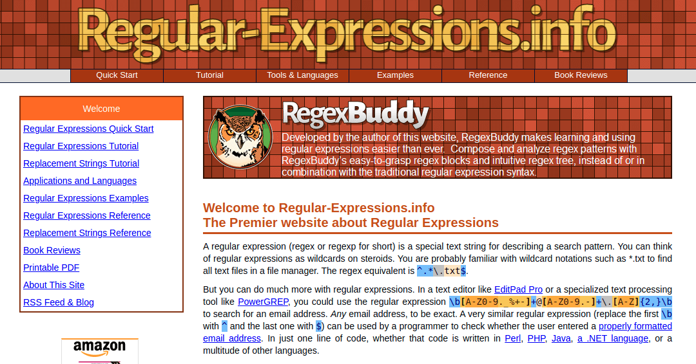
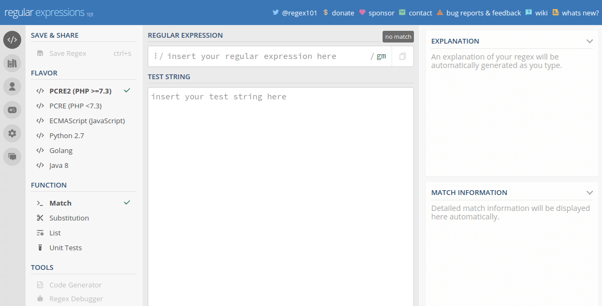
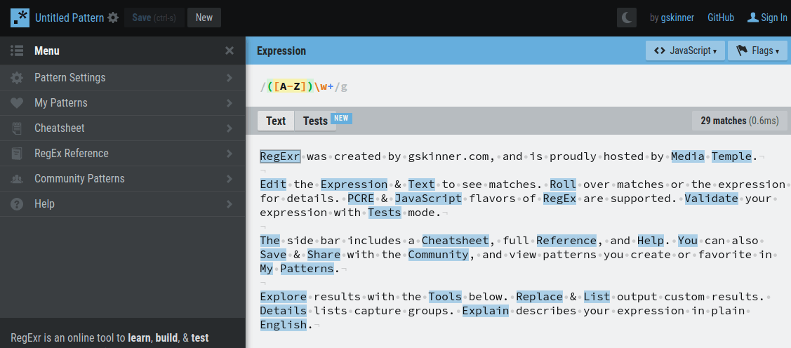
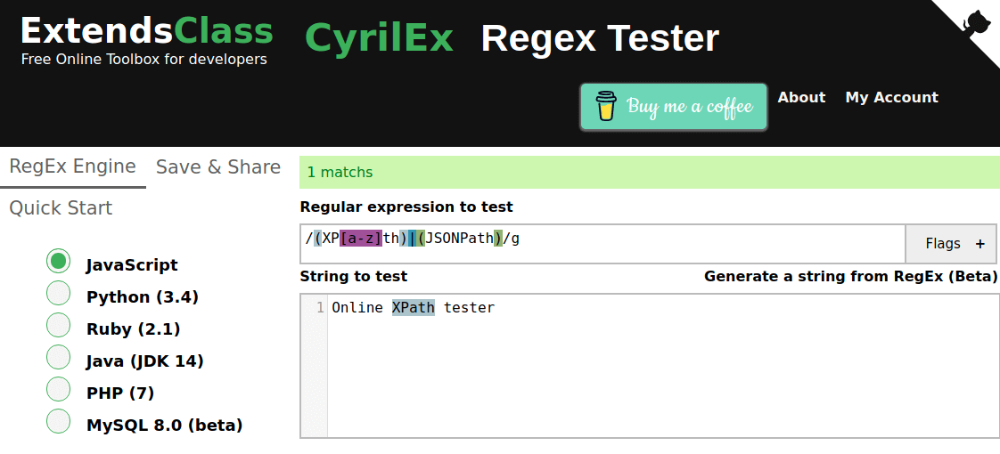

In this post I'm gonna collect some useful resources in order to learn and play with regular expressions. 

<!-- more -->

Because I once again updated the [Regular Expressions in PHP](../../2020/2020-05-04/README.md) article in order to extend the list of tools and resources, I decided to dedicate a full post to these. So in the future I will just update this list of resources.

## Resources

### [Regular-Expressions.info](https://www.regular-expressions.info)

[Regular-Expressions.info](https://www.regular-expressions.info) is a good starting point in order to learn about regular expressions. Also it is pointing you to further resources if you want to dig deeper into the topic.

## Tools

### [Regex101.com](https://regex101.com/)

[Regex101.com](https://regex101.com/) is my favorite tool to debug complex regular expressions that I'm struggling with. I can really recommend this one!

### [regexr.com](https://regexr.com/)

[regexr.com](https://regexr.com/) is another very useful tool in order to explore your regular expressions.

### [regex-tester](https://extendsclass.com/regex-tester.html)

[regex-tester](https://extendsclass.com/regex-tester.html) is another very useful tool in order to explore your regular expressions ...