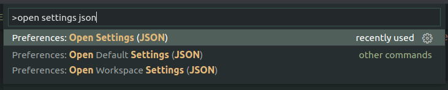

In this post we are going to check out how you can enable [emmet](https://emmet.io/) for a given language in your vscode.

<!-- more -->

It is really simple. First, open up VSCode. Bring up the command palette with `Ctrl+Shift+P` and search for `open settings json`.



Then extend the section `"emmet.includeLanguages": {}` or create it.

Let's say you are playing around with [elixir](https://elixir-lang.org/) and you want to use the [EEx](https://hexdocs.pm/eex/EEx.html) template engine, then you would add the following.

```josn
"emmet.includeLanguages": {
    "html-eex": "html"
},
```

The key `html-eex` (left) is the [language identifier](https://code.visualstudio.com/docs/languages/identifiers) representing the active language. In this example it represents the `EEx` templates. The value `html` (right) represents a language emmet knows already. So in the example we are applying emmet for `html` in files of the type `html-eex`.

If you want to learn more about it, I suggest you check out the [official vscode documentation](https://code.visualstudio.com/docs/editor/emmet#_emmet-abbreviations-in-other-file-types).

And that's it 😁