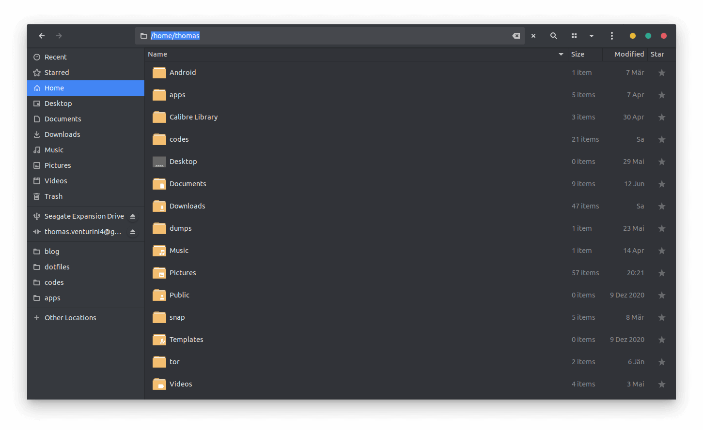

In this short post I'm going to show you how you can manually change the path in the nautilus file explorer.

<!-- more -->

It's really simple. You

1. Open up [Nautilus](https://wiki.gnome.org/action/show/Apps/Files?action=show&redirect=Apps%2FNautilus)
2. Press `Ctrl+L`
3. Now you can enter a path manually
4. Or you press `Esc` to cancel

Awesome right? 😁