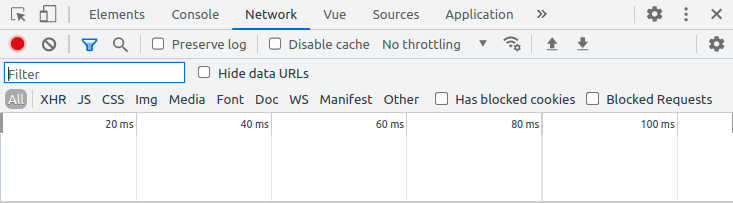
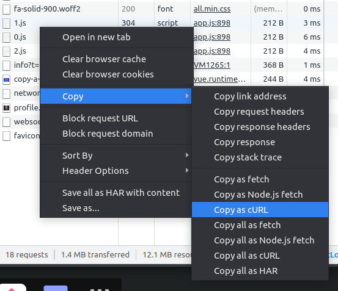

Today I'm going to do a big favour to all backend developers: I'm going to show you how to copy a request as curl from chrome 🧙‍♂️

<!-- more -->

It is actually really simple so I'm just gonna give you a short step by step list.

Open up Chrome and trigger the request you want to share. Then do the following.

1. Press `F12` to open up the developer tools of Chrome.

2. Then click the `network` tab.
   

3. Next you do a right click on the requst you want to make.

4. Then select `Copy > Copy as cURL`
   

5. The request is now in your clipboard and ready to be shared.

```
curl 'http://localhost:8080/articles/copy-a-request-as-curl-from-chrome/' \
    -H 'Connection: keep-alive' \
    -H 'Cache-Control: max-age=0' \
    -H 'sec-ch-ua: " Not;A Brand";v="99", "Google Chrome";v="91", "Chromium";v="91"' \
    -H 'sec-ch-ua-mobile: ?0' \
    -H 'Upgrade-Insecure-Requests: 1' \
    -H 'User-Agent: Mozilla/5.0 (X11; Linux x86_64) AppleWebKit/537.36 (KHTML, like Gecko) Chrome/91.0.4472.114 Safari/537.36' \
    -H 'Accept: text/html,application/xhtml+xml,application/xml;q=0.9,image/avif,image/webp,image/apng,*/*;q=0.8,application/signed-exchange;v=b3;q=0.9' \
    -H 'Sec-Fetch-Site: same-origin' \
    -H 'Sec-Fetch-Mode: navigate' \
    -H 'Sec-Fetch-User: ?1' \
    -H 'Sec-Fetch-Dest: document' \
    -H 'Referer: http://localhost:8080/' \
    -H 'Accept-Language: de-AT,de;q=0.9,de-DE;q=0.8,en;q=0.7,en-GB;q=0.6,en-US;q=0.5' \
    -H 'If-None-Match: W/"163-VYmyj9JdT8ErgD0IY14kSZGWzr4"' \
    --compressed
```

And that's it! Now you can make the backend developers in your team happy and still be lazy 😉