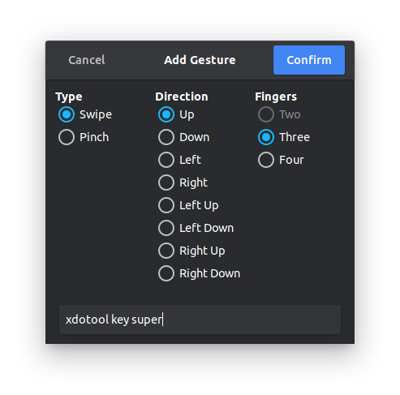

Last weekend I prepared my Huawei Matebook X Pro for my new job. To get a fresh start I installed Ubuntu 21.10. "Impish Indri". Here are the steps I took to set up the touchpad gestures.

<!-- more -->

For the ones too lazy to read on, here is a video, doing the same thing:

<EmbedVideo video="https://youtube.com/embed/ArBCfhVsTZw"></EmbedVideo>

First we need to install [libinput-gestures](https://github.com/bulletmark/libinput-gestures). Previous we need to add our user to the `input` user group.

```bash
sudo gpasswd -a $USER input
```

Also we are going to need to following packages installed.

```bash
sudo apt-get install wmctrl xdotool libinput-tools
```

Then we can finally install `libinput-gestures`.

```bash
git clone https://github.com/bulletmark/libinput-gestures.git
cd libinput-gestures
sudo make install
```

After we have installed `libinput-gestures` we are going to add a utility tool that will allow us to set up the gestures using a GUI.

```bash
sudo apt install python3 python3-gi python-gobject meson xdotool libinput-tools gettext
```

> If you run into problems with `python-gobject`, try installing it with `pip`: `sudo apt install pip -y && sudo pip install gobject`.

You can now start the *Gestures* application and start to set up the smart gestures you need :grin:



> If you run into problems with setting up the gestures, I recommend you check out the wiki. There you will find further examples and a list of the key codes of `xdotool`.

And that's it. Have fun with it!