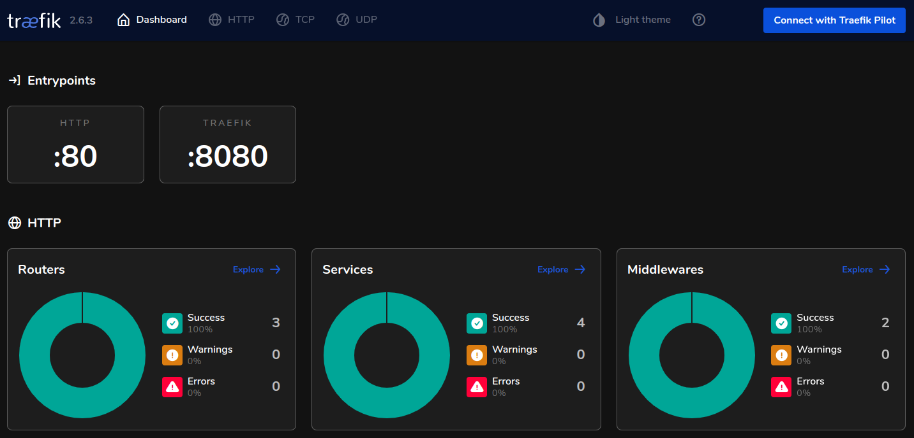
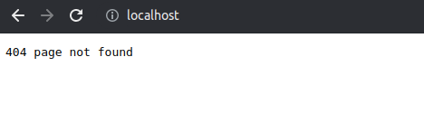
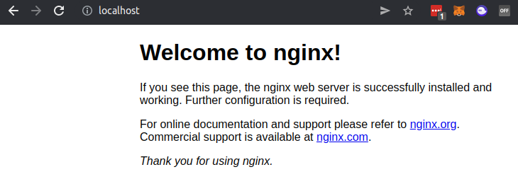
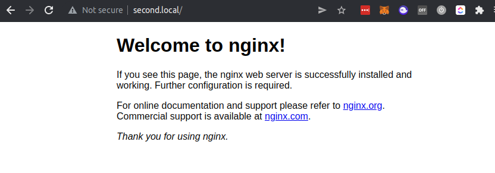

At my new workplace we are making heavy use of docker and docker-compose. In order to make all of the containers talk to each other we use [Traefik](https://doc.traefik.io/traefik). So in order to actually use it I need to understand how Traefik works. Let's dive into it together! 🤓

<!-- more -->

## What is Traefik? 🤔

The documentation puts it that way: *Traefik is an open-source Edge Router that makes publishing your services a fun and easy experience. It receives requests on behalf of your system and finds out which components are responsible for handling them.*

[See the official documentation](https://doc.traefik.io/traefik/) for more information.

## Why do I need Traefik? 🤔

I have multiple `docker-compose` environments on my machine. Before Traefik I could only have one environment running at a time. This is because each environment was using port `80` and `443` for the HTTP and HTTPS traffic. Now that I have Traefik I can have multiple environments running and Traefik will route traffic to the correct environment.

## Getting started with Traefik! 🥳

Let's start our journey by creating a simple Traefik setup that will route port `80` to one of two nginx containers. Don't worry, we will go over it step by step 👍

Before you can start tho you will need to [install docker and docker-compose](https://thomasventurini.com/articles/install-docker-and-compose-in-ubuntu).

Once that is done, create the following `docker-compose.yml` file in a dedicated directory, eg. `tutorial/reverse-proxy`.

```yaml
version: '3'

services:
  reverse-proxy:
    # The official v2 Traefik docker image
    image: traefik:v2.6
    # Enables the web UI and tells Traefik to listen to docker
    command: --api.insecure=true --providers.docker
    ports:
      # The HTTP port
      - "80:80"
      # The Web UI (enabled by --api.insecure=true)
      - "8080:8080"
    volumes:
      # So that Traefik can listen to the Docker events
      - /var/run/docker.sock:/var/run/docker.sock
```

Now navigate into the newly created directory and execute the following to start the container through `docker-compose`.

```bash
docker-compose up -d
```

If this is the first time that you are running Traefik, docker will need to *pull* the image and boot it up. So don't worry if it takes a while 😅

Once the container are running, you should be able to access the following url.

[https://localhost:8080/](https://localhost:8080/)

> If you have other containers running that block this port you might not be able to reach the service. To bring down all your docker containers run `docker container stop $(docker container ls -aq)`.

> If this does not work because there are still other networks blocking, try running `docker network prune`.

> If this still does not work you probably have another service of some kind running on port `80` or `8080` 🙈

If everything worked out, you should see the following in the browser.



Awesome! Traefik is running and you can access the dashboard through port `8080` 🥳

But what about port `80`? 🤔



Doesn't look so good 😥 But that's ok 😉 We are not serving anything on that port yet 😅

Before we can do so, we need to create a network that both environments can sit in. Let's update the `tutorial/traefik/docker-compose.yml` file so it looks like this:

```yaml
version: '3'

networks:
  # configuring the default network of Traefik
  default:
    internal: false
    name: reverse-proxy

services:
  reverse-proxy:
    # The official v2 Traefik docker image
    image: traefik:v2.6
    # Enables the web UI and tells Traefik to listen to docker. Also, 
    #  we don't want to expose containers per default.
    command:
      - "--api.insecure=true"
      - "--providers.docker"
      - "--providers.docker.exposedByDefault=false"
    ports:
      # The HTTP port
      - "80:80"
      # The Web UI (enabled by --api.insecure=true)
      - "8080:8080"
    volumes:
      # So that Traefik can listen to the Docker events
      - /var/run/docker.sock:/var/run/docker.sock
```

Now let us create a [Nginx](https://nginx.org) container.

Create a new directory on the same level as `tutorial/reverse-proxy`, eg. `tutorial/nginx-localhost` and create the following `docker-compose.yml` file within that directory.

```yaml
version: '3.8'

networks:
  reverse-proxy:
    external: true

services:
  nginx-localhost:
    image: nginx:latest
    networks:
      - reverse-proxy
    labels:
      - "traefik.enable=true"
      - "traefik.docker.network=reverse-proxy"
      - "traefik.http.routers.nginx-localhost.rule=Host(`localhost`)"
```

Navigate into the `tutorial/nginx-localhost` directory and execute the following to start the container through `docker-compose`.

```bash
docker-compose up -d
```

Now go visit [http://localhost](http://localhost) and you should see the nginx default page.



Awesome! Now we have our first docker environment that we are exposing on port `80` 🥳

Let's create another one! 🚀

Our next nginx container is going to be provided through the hostname `second.local`. Since we do not have a DNS server in our environment we are going to create an entry in our `/etc/hosts` file. Add the following to your `/etc/hosts` file:

```
127.0.0.1    second.local
```

Now create another folder for the second nginx setup, eg. `tutorial/second-nginx` and create the following `docker-compose.yml` file within that directory.

```yaml
version: '3.8'

networks:
  reverse-proxy:
    external: true

services:
  second-local:
    image: nginx:latest
    networks:
      - reverse-proxy
    labels:
      - "traefik.enable=true"
      - "traefik.docker.network=reverse-proxy"
      - "traefik.http.routers.second-local.rule=Host(`second.local`)"
```

As you can see, it is almost the same file as for the first nginx container. The only difference is that we are now using the hostname `second.local` instead of `localhost` and the service has a different name so we can separate them in the traefik labels - see the last label to see what I mean 🧐

Now navigate into the `tutorial/second-nginx` directory and execute the following to start the container through `docker-compose`.

```bash
docker-compose up -d
```

You should now be able to access the second nginx container through [http://second.local](http://second.local).



Ta-da! We have two containers running on port `80` 🎉

If you want to connect new containers you only need to add the following labels to the given service in your `docker-compose.yml` file.

```yaml
  labels:
    - "traefik.enable=true"
    - "traefik.docker.network=reverse-proxy"
    - "traefik.http.routers.SERVICE-NAME.rule=Host(`SERVICE-HOST`)"
```

And that's basically it! 🎉

If you want to check out more tutorials on how to use Traefik, check out the [Traefik documentation](https://doc.traefik.io/traefik/) or the [GitHub repository](https://github.com/tjventurini/tutorials) that I'm using to experiment with Traefik and other cool stuff.

See you next time! 🤓

