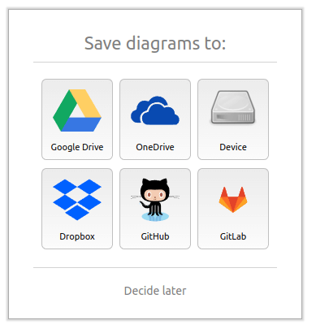
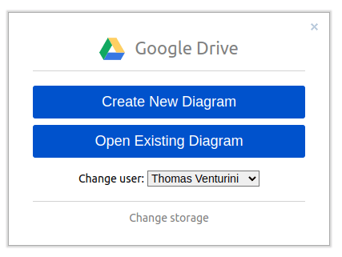
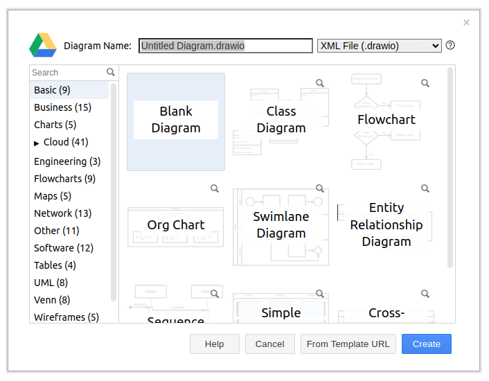
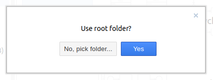
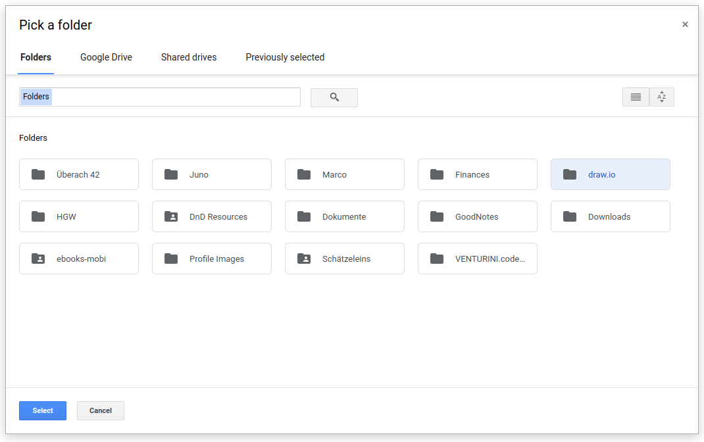
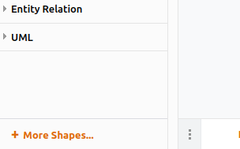
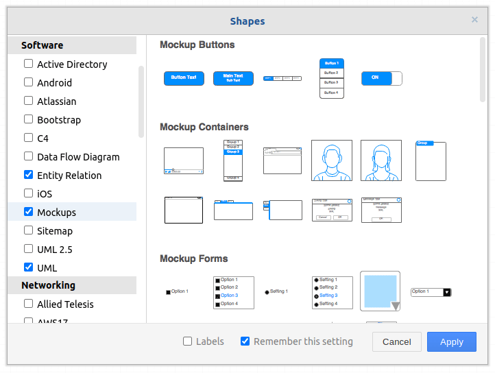
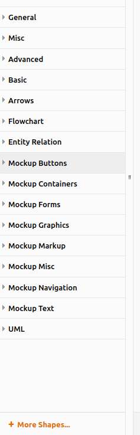
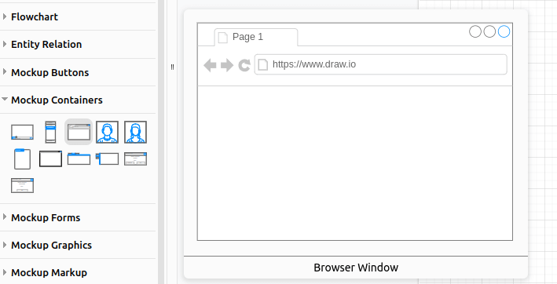

Today I was looking for a tool that I can use to create wireframes to quickly communicate some structural design options to the team. I was surprised to learn that a tool I have been using for years (now and then) can already do so: [draw.io](https://draw.io)

<!-- more -->

## Create a new Diagram

Go to [draw.io](https://draw.io) and select the storage you want to use.

I usually use my Google Drive space for diagrams created with draw.io.

Next you will need to choose if you want to create a new diagram or open an existing one.

For the purpose of this tutorial we want to create a new and blank diagram.

> As you can see, the diagram will be stored as `.drawio` file on the chosen storage.

Draw.io will ask you in which directory you want your diagram to be stored. I usually use a dedicated `diagrams` or `draw.io` directory that has some more structure below.

## Add Mockup Shapes (Wireframes)

Once the diagram is open, we need to add the *Mockup Shapes* provided by draw.io. You can do so through the *+ More Shapes...* menu in the left-bottom-corner.

Search for *Mockups* and select it.

Once you apply your selection, you should see the *Mockup* Categories.

The most important category that will get you started, is *Mockup Containers*. These let you create browser windows.

> The *Mockup Containers* are scalable images that you can use to outline your wireframes.

I will let you play around with the rest of the categories on your own 😉

Have fun! 😁

