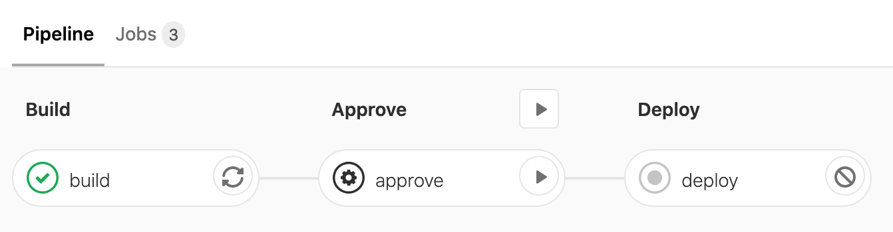

Lately we have been using more and more of our GitLab CI minutes during development. To counter that I restricted the execution of `feature/*` branches to be only executed when manually triggered. That way all developers can push their changes before they go home without worrying about our contingent of GitLab CI minutes.

<!-- more -->

## Rules in GitLab CI 

You can easily define rules on your pipeline jobs by using the `rules` keyword.

```yml
job:
  script: echo "Hello, Rules!"
  rules: # 👈
    - if: $CI_PIPELINE_SOURCE == "merge_request_event"
      when: manual
      allow_failure: true
    - if: $CI_PIPELINE_SOURCE == "schedule"
```

> Check out the documentation for more information on how to use [rules](https://docs.gitlab.com/ee/ci/jobs/job_control.html).

In order to restrict the execution of the `feature/*` branches we need to use a regular expression. This could look like the following.

```yml
rules:
 - if: $CI_COMMIT_REF_NAME =~ /^feature/
   when: manual
```

## Make the Rule reusable

Since we might have multiple starting points that start in parallel we do want to have our rule in a reusable manner. To reuse our rule we need to create a [anchors](https://docs.gitlab.com/ee/ci/yaml/yaml_optimization.html#anchors) and [reference tags](https://docs.gitlab.com/ee/ci/yaml/yaml_optimization.html#reference-tags).

### Anchors

```yml
.feature_branch_rule: &feature_branch_rule
  rules:
    - if: $CI_COMMIT_REF_NAME =~ /^feature/
    when: manual
```

### Reference Tags

```
job:
  script: echo "Hello, Rules!"
  rules:
    - !reference [.feature_branch_rule, rules] # note the second element in the array
```

## Putting it all together

Now all that's left, is to update your own `gitlab-ci.yml` file. Put the anchor somewhere in the top, just make sure that you have it on the root level and before the jobs definition. Then, in the jobs that represent the starting point of your pipeline, apply the rules as shown below.

```yml
# some where on top
.feature_branch_rule: &feature_branch_rule
  rules:
    - if: $CI_COMMIT_REF_NAME =~ /^feature/
    when: manual

job:
  script: echo "Hello, Rules!"
  rules: # apply the rules
    - !reference [.feature_branch_rule, rules] # note the second element in the array
```

And that's it! Now you will need to click the manual trigger action to start the execution of your feature branches.



## Done!

And that's it! You can now apply this rule, or similar rules to all jobs you want to restrict based on a regular expression on the branch name or tag. Isn't that awesome? 🤩


> Check out the [documentation](https://docs.gitlab.com/ee/ci/jobs/job_control.html#reuse-rules-in-different-jobs) in order to learn more on that topic 🤓