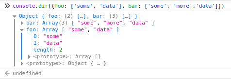
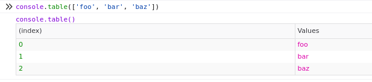
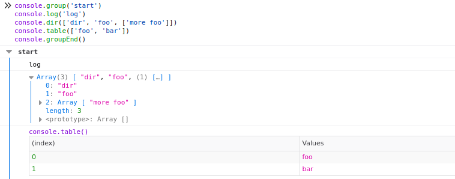
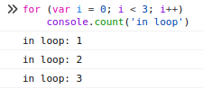
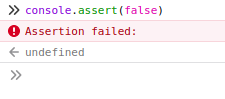

The other day I found a nice [thread 🧵](https://twitter.com/codeforreal_/status/1546394393682227200) explaining different `console` methods, that can be used instead of `console.log()`. Let us take a closer look! 🤓

<!-- more -->

## `console.dir()`

This method will display an interactive view of the object you want to log.

## `console.table()`

This method will display a table view of the object you want to log.

> Had some issues with this method in chrome where it would not display the last item in the table 🤷

## `console.group()` and `console.groupEnd()`

These methods allow you to group your console output together.

## `console.time()` and `console.timeEnd()`

These methods allow you to start and stop a timer and log the duration of the commands executed in between.

## `console.count()`

This method let's you count how often you have called a specific `console.count()`.

## `console.assert()`

This method writes an error message to the console if the assertion is false. If it is true, nothing is logged.

## Done!

Now you have a couple of alternatives to `console.log()` in your tool belt. Have fun with it!

Thanks for this awesome [thread 🧵](https://twitter.com/codeforreal_/status/1546394393682227200) [@codeforreal_](https://twitter.com/codeforreal_) 💪