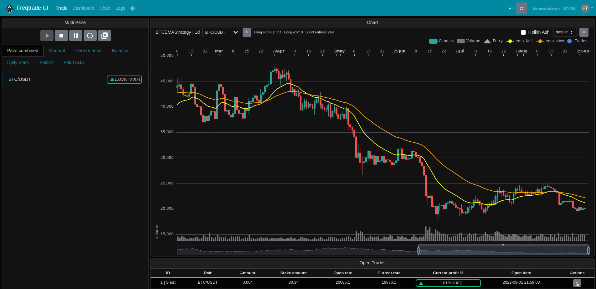
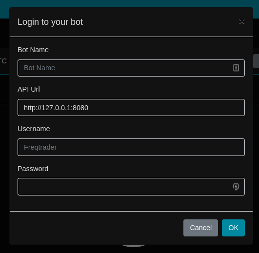

Recently I have been playing around with algorithmic trading tools such as [Freqtrade](https://freqtrade.io), so I thought I should share my learnings. Let's get into it! 🤩

<!-- more -->

<EmbedVideo video="https://youtube.com/embed/PrPGKHCx5qY" />

## What is Freqtrade? 🤔

The [documentation](https://www.freqtrade.io/en/stable/) introduces Freqtrade like so:

> Freqtrade is a free and open source crypto trading bot written in Python. It is designed to support all major exchanges and be controlled via Telegram or webUI. It contains backtesting, plotting and money management tools as well as strategy optimization by machine learning.

Freqtrade enables you to write your own strategies in python and backtest them using data from your exchange. On top of that you can leverage the machine learning implementation Freqtrade comes with in order to optimize your strategies.



## Installing Freqtrade

We are going to use the [docker setup](https://www.freqtrade.io/en/stable/docker_quickstart/) provided by Freqtrade. This is the simplest way of using Freqtrade so I highly recommend using this for your studies.

```bash
mkdir freqtrade-bot
cd freqtrade-bot/
# Download the docker-compose file from the repository
curl https://raw.githubusercontent.com/freqtrade/freqtrade/stable/docker-compose.yml -o docker-compose.yml

# Pull the freqtrade image
docker-compose pull

# Create user directory structure
docker-compose run --rm freqtrade create-userdir --userdir user_data

# Create configuration - Requires answering interactive questions
docker-compose run --rm freqtrade new-config --config user_data/config.json
```

After executing the above you now have a project folder, `docker-compose.yml`, and configuration. All we need now is a strategy to play with.

## Strategies

Freqtrade ships with a `SampleStrategy` that we can explore. You can find it under `freqtrade-bot/user_data/strategies/sample_strategy.py`.

> I plan on covering freqtrade strategies in detail in one of my next articles, so I will just briefly go over the most important things to know.

All strategies in Freqtrade extend the `IStrategy` class.

```python
# This class is a sample. Feel free to customize it.
class SampleStrategy(IStrategy):
```

If your strategy should be allowed to go short, you need to set the following attribute to true.

```python
# Can this strategy go short?
can_short: bool = False
```

You can hardcode your *Stop-Loss* in percent, or you can use the `custom_stoplos()` method, which will overwrite the `stoploss` attribute of your strategy.

```python
# Optimal stoploss designed for the strategy.
# This attribute will be overridden if the config file contains "stoploss".
stoploss = -0.10

# Custom stoploss method.
def custom_stoploss(self, pair: str, trade: 'Trade', current_time: datetime, current_rate: float, current_profit: float, **kwargs) -> float:
    stoploss = self.stoploss

    stoploss_target = ...

    stoploss = stoploss_from_absolute(stoploss_target, current_rate, is_short=trade.is_short)

    return stoploss
```

> Notice, that you have to work with percent here. At least you get help from the `stoploss_from_absolute` helper method 😉

Make sure to define a default timeframe for your strategy. Your configuration will overwrite this attribute if set.

```python
# Optimal timeframe for the strategy.
timeframe = '5m'
```

The `populate_indicators()` method is where you can calculate the indicators that you want to use for trading. You will find a lot of examples in the `SampleStrategy` on how to create indicators.

```python
def populate_indicators(self, dataframe: DataFrame, metadata: dict) -> DataFrame:
```

The `populate_entry_trend()` is the place where you can decide if your strategy should open a trade - short or long.

```python
def populate_entry_trend(self, dataframe: DataFrame, metadata: dict) -> DataFrame:
```

Once into a trade, your strategy also needs a way to exit the trade. The method that handles this is `populate_exit_trend()`.

```python
def populate_exit_trend(self, dataframe: DataFrame, metadata: dict) -> DataFrame:
```

## Trade a strategy 🤑

Once we have a strategy (you can use the `SampleStrategy` for now) we can make use of it within Freqtrade. To do so, we need to specify it in the start command in the `docker-compose.yml` file.

```yml
# Default command used when running `docker-compose up`
command: >
    trade --logfile /freqtrade/user_data/logs/freqtrade.log --db-url sqlite:////freqtrade/user_data/freqtrade.sqlite --config /freqtrade/user_data/freqtrade.json --strategy SampleStrategy
```

Let's explore this command 🧐

Under the hood, this is using the `freqtrade trade` command. It also specifies a logfile to use using `--logfile`, a sqlite database using `--db-url`, a configuration to use using `--config` and finally the strategy to use using `--strategy`.

> Note that you need to specify locations from within the containers, not your host system.

## Starting the Bot! 🚀

Once we have setup all of this, we can finally start the bot using the following.

```bash
docker-compose up -d
```

This will spin up the Freqtrade container and provide you with a web interface that you can use to monitor your bot. You should be able to access the web interface through [127.0.0.1:8080](http://127.0.0.1:8080).



Name your bot and enter the credentials you have set during the setup of your configuration file.

## Done!

And that's it! You are now able to setup your own trading bots! 💪

For further information, please visit the [Freqtrade documentation](https://www.freqtrade.io).

You can also check out my current setup - that I'm actually using to trade! - on [GitHub](https://github.com/tjventurini/freqtrade).

